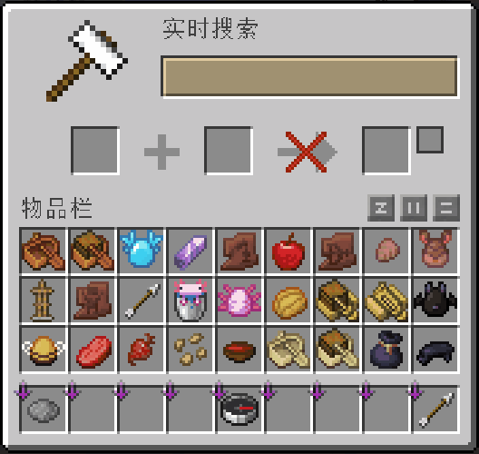
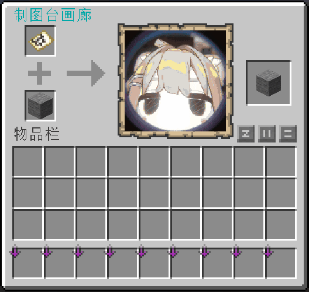
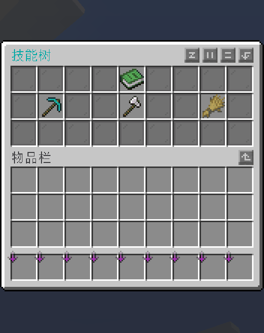
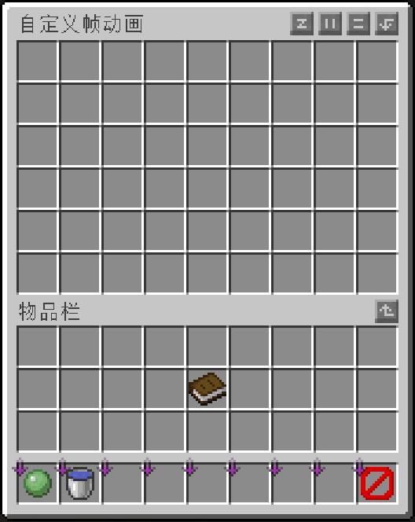
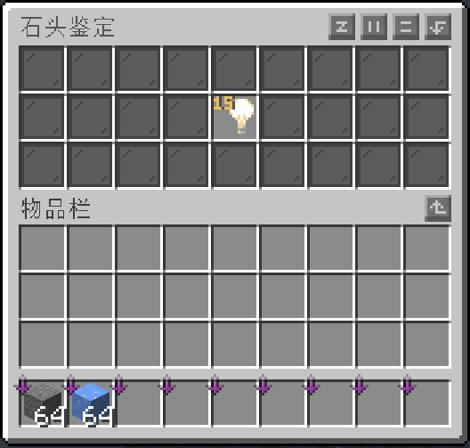

<h1 align="center">Sparrow UI</h1>

<p align="center">
  A reactive UI framework for Paper and Folia
</p>

<p align="center">
  <a href="https://github.com/Catnies/sparrow-ui/stargazers"></a>
  <a href="https://github.com/Catnies/sparrow-ui/issues"></a>
  
  
  
  
</p>

<p align="center">
  <strong>English</strong> · <a href="./README_CN.md">简体中文</a>
</p>

Sparrow UI is a reactive inventory UI library for Paper and Folia. It brings menu state, inventory interaction, rendering, and navigation into a reusable component model, allowing the same Item, Pane, and Inventory instances to safely serve multiple players.

> [!IMPORTANT]
> Sparrow UI is currently in beta. Public APIs may continue to change before the first stable release.

## Features

- **Comprehensive native menu APIs.** Sparrow UI supports chests, anvils, brewing stands, cartography tables, crafters, crafting tables, dispensers, droppers, enchanting tables, all three furnace variants, grindstones, hoppers, merchants, smithing tables, and stonecutters. Each menu type has its own Window API for native features such as progress bars, buttons, recipe books, trades, and map previews.

- **Synchronous, asynchronous, and lazy Item rendering.** Items can render immediately, await database or network data through a Future, or resolve a shared resource once on first attachment. Placeholders remain visible while work is in progress, and stale results cannot overwrite newer renders.

- **Reusable UI components with multiple observers.** The same Item, Pane, or Inventory can be attached to several Windows and shown to multiple players without rebuilding the shared component tree. When a component changes, every observer is notified while each Window rerenders only the affected slots.

- **Virtual and referenced inventories.** `VirtualInventory` behaves like a regular container and supports placement, removal, dragging, shift-clicking, number-key swaps, slot rules, stack limits, and persistence. `ReferencingInventory` connects player inventories, Bukkit containers, or custom storage to the same menu model, including concurrent access by multiple viewers.

- **Transactional inventory interaction.** A click is planned as one transaction containing the participating Inventories, slot changes, cursor, off-hand item, and dropped items. Sparrow UI works with Bukkit's `InventoryClickEvent` and `InventoryDragEvent`, while its own events can inspect, edit, or cancel the complete operation; cancellations and concurrency conflicts abort before any participating Sparrow Inventory is written.

- **Multi-Window menu sessions.** `WindowSession` provides stack, retained-stack, and tree structures for composing larger menu flows. Forward navigation, back navigation, ESC handling, asynchronous construction of the next Window, and session shutdown share one lifecycle, while retained Windows keep their page, scroll position, and menu data.

- **Layered visuals and animations.** Inventory, Pane, Window, cursor, and title rendering each have their own visual layer, so display effects never mutate real inventory content. Inventory and Pane effects are shared by all observers, Window effects remain viewer-specific, and multiple animations can run in layers.

- **A reactive Signal system with weak subscriptions.** Signals support mapping, combining, asynchronous loading, polling, debouncing, throttling, List, Set, Map, and per-player partitions. Items and Panes declare their dependencies directly; when no observers remain, derived chains and polling tasks stop and become eligible for collection.

- **Signal-driven pagination.** `Page` exposes its content, current page, page count, and visible item count as Signals. It supports dynamic lists, partitioned page sources, asynchronous database loading, caching, refresh, and prefetch, with the same model extending to `Scroll` and `Tab`.

- **Thread-safe by design for Folia.** Window lifecycle and protocol operations are serialized on the viewer's entity thread, while shared components and virtual inventories accept concurrent access from different player threads. Fixed lock ordering and version validation prevent deadlocks and stale writes without bypassing Bukkit's entity and region-thread rules.

## Compatibility

Sparrow UI uses one artifact for Paper and Folia from `1.21.8` through `26.2`; no per-version dependency changes are required.

| Minecraft version | Paper | Folia |
| :---: | :---: | :---: |
| `1.21.8` ~ `26.2` | ✅ | ✅ |

> [!NOTE]
> Sparrow UI is compiled for Java 21. At runtime, use the Java version required by your Paper or Folia server version.

## Gradle

Sparrow UI is a library and must be bundled into your final plugin artifact. It does not need to be installed separately on the server.

```kotlin
repositories {
    maven("https://repo.momirealms.net/snapshots")
}

dependencies {
    implementation("net.momirealms:sparrow-ui:beta.21")
}
```

---

## Showcase

<p align="center">
  <a href="./assets/readme/live-search.gif"></a>
  <a href="./assets/readme/cartography-gallery.gif"></a>
</p>

<p align="center">
  <a href="./assets/readme/skill-tree.gif"></a>
  <a href="./assets/readme/custom-frame-animation.gif"></a>
</p>

<p align="center">
  <a href="./assets/readme/stone-appraisal.gif"></a>
</p>

## Acknowledgements

Sparrow UI initially drew inspiration from [InvUI](https://github.com/NichtStudioCode/InvUI) and its separation of Window, layout, and VirtualInventory responsibilities. It later developed its own Signal, transaction, visual-layer, and session systems around its own goals. [CraftEngine](https://github.com/Xiao-MoMi/craft-engine)'s multi-version architecture and protocol work also served as a reference.
